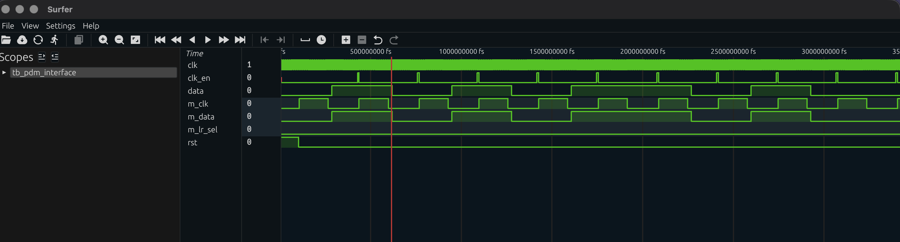
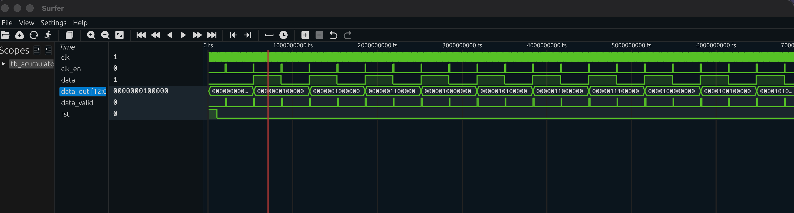
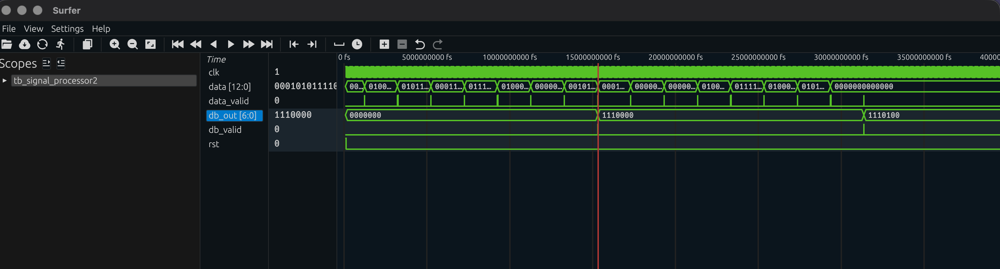
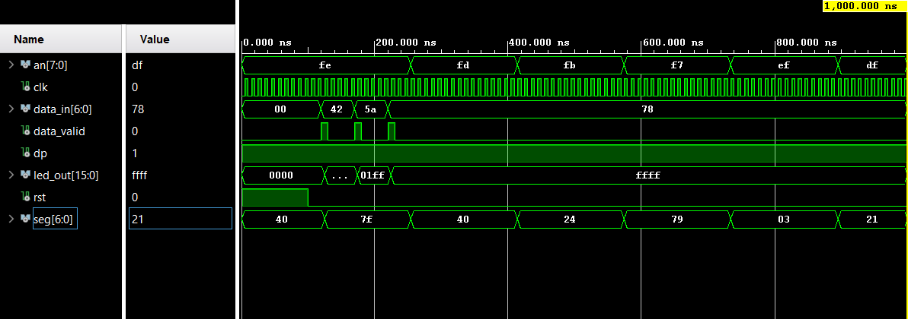

# DE1-Audio-Visualizer

# Team Members:

- Matouš Huczala 
- Jerguš Gecík 
- Samuel Pažítka
- Pavel Uher

# Overview

Our project is an Audio Visualizer realised on a Nexys A7-50T FPGA board. It samples real-time audio using the onboard ADMP421 MEMS microphone and processes the PDM signal to measure the current sound level. The result is displayed as a dB value on the 7-segment display and as a visual bargraph across 16 LEDs.

On a 7-segment display, according to the implementation, we are theoretically able to display the signal volume from 54 to 120 decibels (this is how our LUT is also calibrated), we did not test the maximum value. On a 16 LEDs we display values ​​from 54dB to 80dB for clarity. Our audio visualizer as an SPL meter does not have implemented weighting curves (like A, C or Z), the maximum measurable frequency should be 12kHz (in connection with the moving average implemented in the accumulator).

The design consists of four components: [pdm_interface](source%20files/pdm_interface.vhd), [acumulator](source%20files/acumulator.vhd), [a LED driver](source%20files/LED_driver.vhd) and a [signal_processor](source%20files/signal_processor.vhd).

# Block Diagram

.png)

# Inputs

The system is controlled using the integrated buttons and clock signal on the Nexys A7 board:

**Clock signal:**
* **`clk`** - System clock signal 100 MHz, pin `E3`.

**Buttons:**
* **`rst` (`BTNC`)** - Resets the system to its default state, pin `N17`.

**Microphone:**
* **`m_data`** - PDM data input from the onboard ADMP421 microphone, pin `H5`.

# Outputs

The measured sound level values are output to the following peripherals:

**Seven-segment display:**
* **Segment 0 (DISP 1)** - Displays the units digit of the sound level value in dB, pin `J17`.
* **Segment 1 (DISP 2)** - Displays the tens digit of the sound level value in dB, pin `J18`.
* **Segment 2 (DISP 3)** - Displays the hundreds digit of the sound level value in dB, pin `T9`.
* **Segment 2 (DISP 4)** - Displays the character `b`, pin `J14`.
* **Segment 3 (DISP 5)** - Displays the character `d`, pin `P14`.
* **Decimal point (DP)** - pin `H15`, permanently off.

**LED bargraph:**
* **`LD0–LD15`** - Visual indication of the sound level. No LEDs are lit during silence, all LEDs are lit at 80dB.

**Microphone control outputs:**
* **`m_clk`** - PDM clock signal for the ADMP421 microphone (~3.03 MHz), pin `J5`.
* **`m_lr_sel`** - Microphone channel select, permanently set to `'0'` (left channel), pin `F5`.

# Simulation Results
Showcase of the simulations for each individual module used in the project.

## PDM Interface
*[PDM_interface](source%20files/pdm_interface.vhd) is a merger of beta components microphone and clock_divider. It divides the main clock, sends a signal with a duty cycle of 50% to the MEMS microphone and sends enable pulses of the same frequency to the `accumulator`*

*Simulation showing the generated PDM clock (`m_clk`) toggling at ~3.03 MHz. Simulation also simulates the behavior of the microphone, on the rising edge it produces a data sample (1 or 0) and on the falling edge it sends the value.*

## Accumulator
*[Accumulator](source%20files/acumulator.vhd) calculates the PDM signal from `pdm_interface`. It is implemented as a 128-bit shift register. With each enable signal it sends its new value to the `signal_processor`. It serves as the first averaging low-pass filter. According to the sampling theorem, our implementation is capable of processing frequencies up to approximately 12kHz*

*The accumulator counts the incoming bits from the `pdm_interface` and with each enable signal sets `data_valid` and sends data out. In the testbench we simulate: the average value (sequence 0 and 1, when the value stabilizes at 2048), maximum pressure (sequence 1, when the value stabilizes at 4096), minimum pressure (sequence 0, when the value stabilizes at 0)*

## Signal Processor
*[Signal_processor](source%20files/signal_processor.vhd) receives data from the `accumulator`, performs its absolute value and, according to the new implementation, calculates the average value of this signal. The averaging window is 173ms long, which relatively corresponds to the standard for SPL FAST, which is 125ms. The calculated value is compared with the values ​​in the LUT and sent to the component output as a value in decibels. The component also performs calibration of the displayed level.*

*LUT converting the accumulator output to a calibrated dB value. The `db_out` signal is updated after our time constant (173 ms) has elapsed, for testing the averaging time is shortened.*

## LED Driver
*[Led driver](source%20files/LED_driver.vhd) recieves the dB value from Signal proccesor, it then maps the value on the 16bit LED bargraph and also drives the multiplexor 7-segment display showing the measured value as a 3-bit dB reading.*

*Three input samples (66, 90 and 120 dB) are applied via `data_valid`, with `led_out` stepping from `0x0000` to `0xffff` which confirms correct behaviour. The `an` and `seg` signals cycle through all 8 display digits.*

# Resource Utilization

| Resource | Used | Available | Utilization |
|----------|------|-----------|-------------|
| LUT      | 143  | 32600     | 0.44%       |
| FF       | 243  | 65200     | 0.37%       |
| BRAM     | 1    | 75        | 1.33%       |
| IO       | 37   | 210       | 17.62%      |

# Media
- **[A3 poster](<https://canva.link/xmjbbbmcxwonoue>)**
- **[Video demonstration](<https://canva.link/xmjbbbmcxwonoue>)**

# References and Tools
## Tools
- **Vivado Design Suite:** Used for synthesis and bitstream generation.
- **Vivado Simulator:** Used for verification of functionality of each module.
- **Git:** Documentation.
- **Claude/Gemini:** Used for general tech-support and verification.
- **Draw.IO:** Used for the creation of the block diagram.
  
 ## References
- **[IEEE Standard 1076-2008 - VHDL Language Reference Manual](<https://0x04.net/~mwk/vstd/ieee-1076-2008.pdf>)** 
- **[Nexys A7 Digilent Reference](<https://digilent.com/reference/programmable-logic/nexys-a7/start>)** 
- **[Online VHDL Testbench Template Generator](<https://vhdl.lapinoo.net>)**
- **[Reference Tone Generator](<https://www.szynalski.com/tone-generator>)** 
